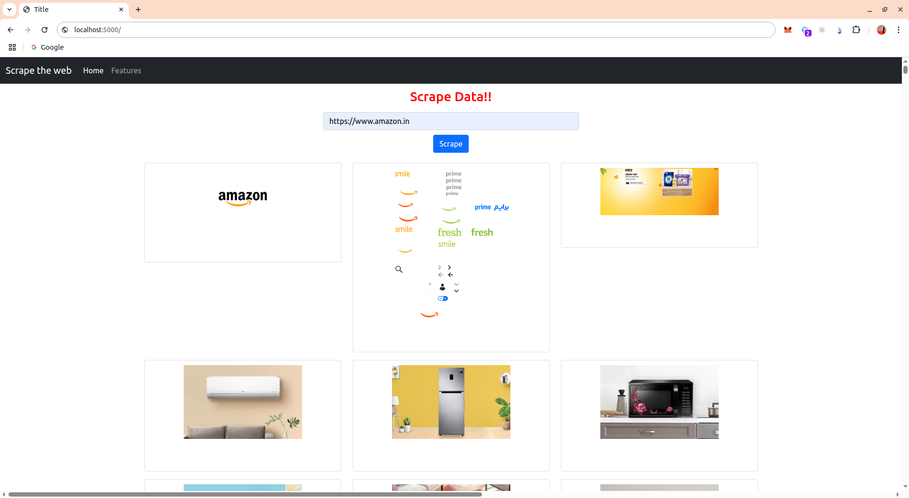

# 🕸️ Web Scraper App

A minimal Flask web app that scrapes a given URL and extracts:

- All image sources (``)
- All hyperlinks (`<a href>`)
- All text inside `<div>` tags

## 📷 Screenshot



## 🚀 How to Run

Clone the repo:

```bash

git clone https://github.com/Ashcroft-lab/Scraper_project.git
cd Scraper_project
```

Create a virtual environment (optional but recommended):

```bash
python -m venv venv
source venv/bin/activate
```

Install requirements and run `main.py`
```bash
pip install -r requirements.txt
python3 main.py
```
Visit: http://localhost:5000